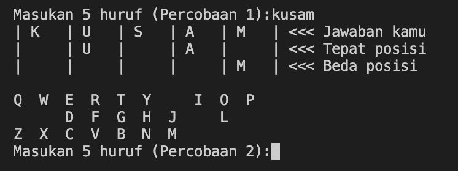
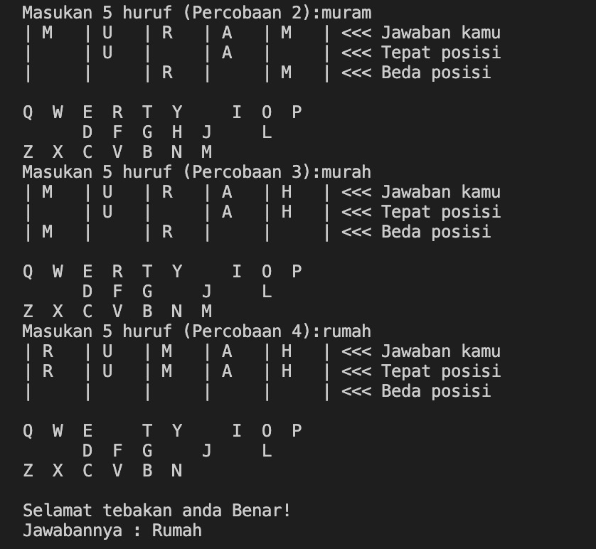

# **README**

## **Introduction**
Hello, today i'd like to introduce you my first fun-work. It's a simple guessing game inspired by KATLA. Some of you might have heard this game called KATLA. You can check it on the [link here](https://katla.vercel.app).

---

## **How to Play**
This game involve 2 role of players. Game Master and Player. Game Master will decide what the secret word and how many times player have to guess. Player then will try to guess what secret word the game master gave before. Player will have no clue about what the word is, no description about the word. But, player can sharpen their guess by looking at number of correct word and its position.

You can try to play it with your friends, your family, your college, even your girlfriend / boyfriend!

- **Game Master**
    1. Game master should input the secret word containing only 1 word. 
    
    2. Game master should input the max number of try-chance for player.  
    
    3. Watch the player dive into confussion. :D
    
- **Player**
    1. Player simply write the word and press enter when done.  
    
    2. System will give clues based on the word the player guessed, correct word and either in right or wrong position.  
    
    3. Player should continue guessing until the max try-chance runs out or finally guessing the right word. Pay attention to the clues given: correct word, correct positon, and remaining letters.  
    

---

## **Final Words**
Thanks for playing this game!  
This mini game is made for me to challenge my self in my learning journey using Python 3. So this game is built upon Python 3. This game doesn't connect to any databases and only run on single file.

---

###### **This app is created by Diki Renanda / @dikisahkan. You can reach me through any social media GitHub, Medium, LinkedIn, IG, and TikTok.**