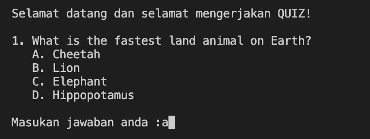
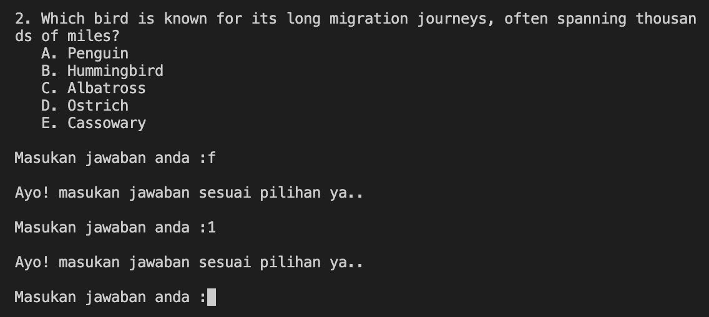
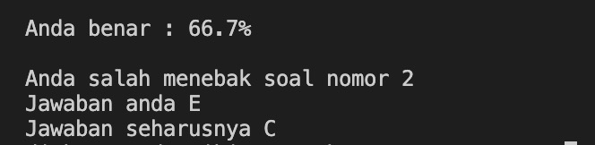

# **README**

## **Introduction**
Hello everyone! I made a simple quiz app. It's just a prototype i made to explore my skill and logic in writing code in Python 3.

This is just a small quiz app contains only three questions. The questions themself are hardcoded in the code using Dictionary data collection type. So this app doesn't connect to any database and run in single file only.

---

## **The Quiz**
The quizz contains 3 questions with multiple choices. The amount of multiple choices vary dynamically based on the data in dictionary.

Here's a sample of the questions:  

The app also has ability to validate the answer. If you give answer other than the letter of multiple choices, the app will ask you to input again.  

At the end of the quiz when the questions run out, the app will calculate user score based on correct answer. The answers are also stored in the data dictionary. The app will match user's answer to the data dictionary. The app will also tell you which answers were wrong wand what are the correct ones.  

---

###### **This app is created by Diki Renanda / @dikisahkan. You can reach me through any social media GitHub, Medium, LinkedIn, IG, and TikTok.**