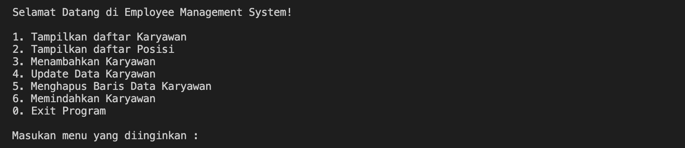
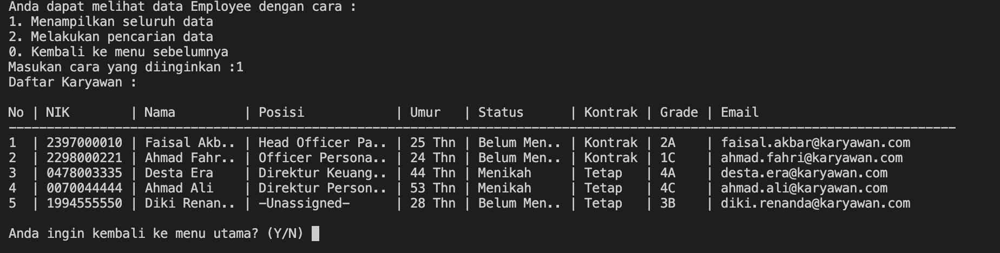
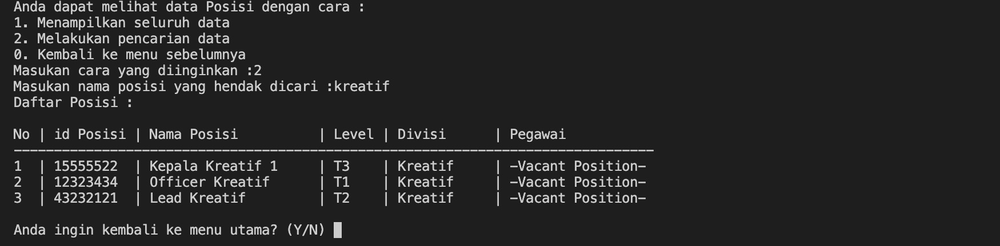
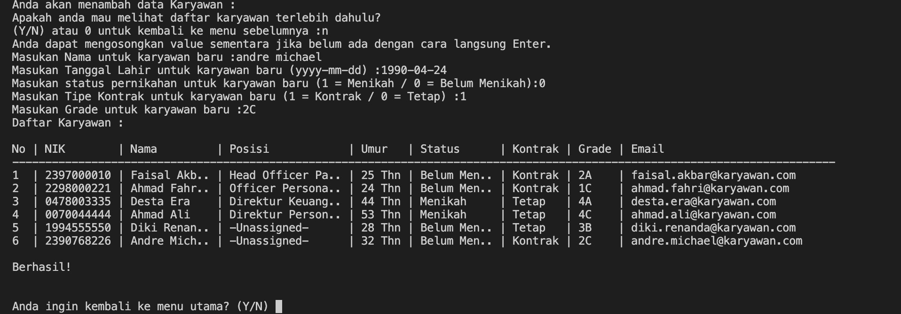
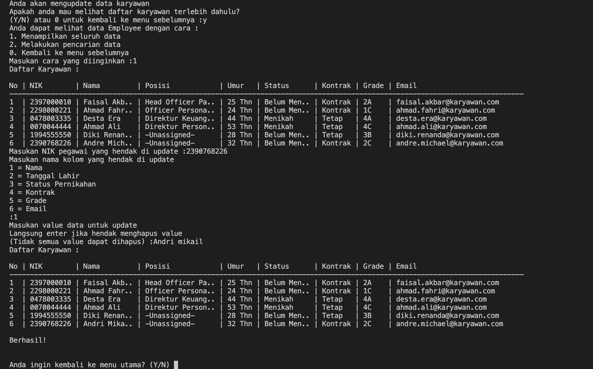
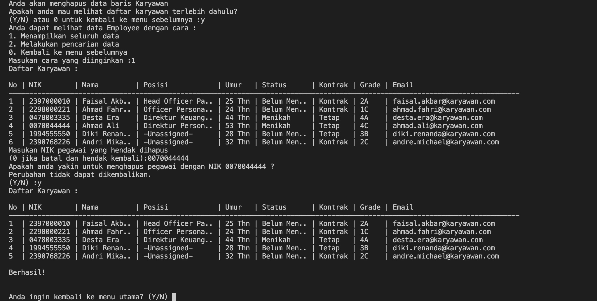
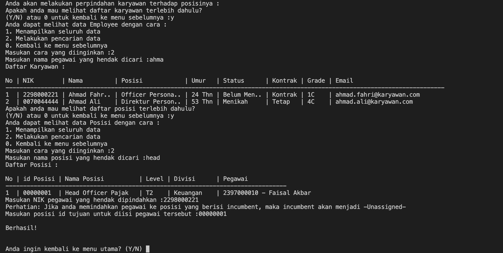

# **README**
Please, read this before before you continue to use the app or if you have any trouble running the app.

This app is created as a first capstone project for me to participate in Data Science course in Purwadhika. The app is about making CRUD functionality. So this is just a mini-app to work on my learning journey towards data science. This app might have some flaws and might not really represent actual workflow, but i tried my best. ;D

This app is built upon Python v3 as its only programming language.

The data you see here is hardcoded in the file and will restart if you re-run the app. The app doesn't connect to any databases. The data included in the app is a fictional data.

`Please take notes : This app runs using Bahasa Indonesia as interface language.^`  
##### 
^Some annotations and variables name in the code also use Bahasa Indonesia.

---

## **Introduction to the App**
Welcome to Employee Management System!  
An apps that lets you manage your employee database.
The feature that is provided in this apps are:  
- Viewing employee data
- Viewing position data
- Adding new employee data
- Updating current employee data
- Deleting current employee data
- Assigning employee to other position

Here is the screenshot of the main menu:

---

## **Features**
Lets take a glimpse look to the feature one-by-one.

### **1. Viewing Employee Data**

In this section, you can look into employee data.
Varying from NIK (Employee Number), name, position, age, marital status, contract type, grade, and email. NIK here will be used as a key to do actions later in the app.

You can view full list of employee or partial data, means you can search certain employee based on their name. The search capability is ignoring wheter it's capitalized letter or not.

FYI, age you see in the table is based on employees DOB (Date of Birth). I hide date of birth data because it's a type of data that is strictly confidential to the company and employee.

The position data shown here is taken realtionally from position data and not necessarily present in the employee table.

### **2. Viewing Position Data**

In this menu, you can look into position data.
Varying from position id, name, level, division, incumbent (current employee in the position). Position id here will be used as a key to do actions later in the app.

You can view full list of position or partial data, means you can search certain position based on its name. The search capability is ignoring wheter it's capitalized letter or not.

Incumbent / employee data shown here is taken relationally from employee data. There's a key id in position data that contains key id from employee data.

### **3. Adding New Employee Data**

In this menu, you can add new employee data.
All the field in employee data will be asked to be filled to add a row of employee data. You can only add single employee in one turn.

There's also an instruction on how to fill the correct data for each field. The input will ask again if your input doesn't meet the criteria. Some field could be left empty by simply press enter and some not.

You won't have to input NIK because it will be generated based on data you input. NIK Generated will always have 10 digits.

The employee you input will be unassigned to any position at first. To add position to the employee, you can use "Assigning Employee to Other Position" menu which will be elaborated later.

### **4. Updating Current Employee Data**

With this feature, you can alter / edit employee data field-by-field. You can change the value of name, DOB, marital status, contract type, grade, and email. You can also empty the value by simply press enter. You can only change single value of single employee in one turn.

All field can be altered except NIK. The data you update also won't have impact to NIK (as you know, NIK was generated based on employee data).

There's no instruction on how to fill the correct data for each field. But, I makesure that every value you input is validated. If it doesn't meet the criteria, the input will ask again and give you clue on how the value should be.

Position of the employee cannot be updated here. It can be updated in "Assigning Employee to Other Position" feature which will be explained later on.

### **5. Deleting Current Employee Data**

In this feature, you can delete the record of employee (a row of employee) by simply entering the NIK you want to delete. You can only delete single employee in one turn.

If you choose to delete employee that has current position, the position data will also be updated making it a vacant position.

### **6. Assigning Employee to Other Position**

This is the latest feature in the app. In this feature, you can assign employee to any position. You can assign assigned or unassigned employee to any position, either vacant position or position with incumbent in it. You can only assign single employee in one turn.

If you choose to assign an employee to a vacant position, their key will be filled to position data. If you choose to assign an employee to position with incumbent in it, it will replace the key in that position data leaving the incumbent unassigned.

To map this change, you need to input NIK of employee that wants to be moved and Position ID of the target position. Don't worry if you don't remember the ID, I provide you with option to check the employee and position data first.

---

###### **This app is created by Diki Renanda / @dikisahkan. You can reach me through any social media GitHub, Medium, LinkedIn, IG, and TikTok.**